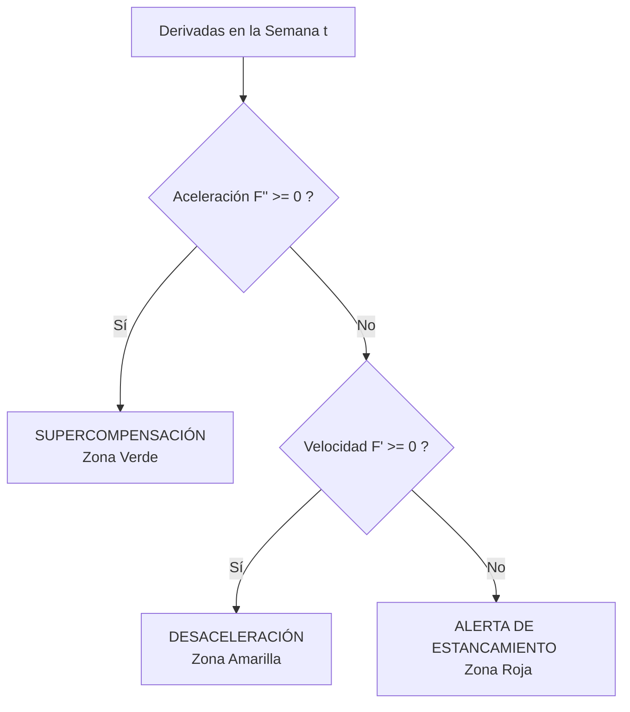

# Explicación del Algoritmo de Telemetría Neuromuscular e Inflexión de Fuerza

Este documento detalla el funcionamiento lógico, matemático y fisiológico del **Algoritmo de Telemetría Neuromuscular In-Device** desarrollado para PLNEXC.

---

## 1. ¿Por qué se creó este algoritmo?

En los deportes de fuerza, la fatiga neuromuscular se acumula mucho antes de que el atleta experimente fatiga subjetiva o una lesión física. El progreso adaptativo no es lineal: responde a una curva de rendimientos decrecientes y acomodación fisiológica.

### Problemas que resuelve:
1. **Prevención del Estancamiento Temprano (Plateau)**: Alerta al atleta para que realice una semana de descarga (*deload*) antes de que su rendimiento empiece a decrecer de forma neta.
2. **Privacidad de Datos Biométricos (*Edge Computing*)**: Dado que el historial de fuerza y el peso corporal son datos biométricos sensibles, el procesamiento matemático complejo se realiza en el navegador del usuario de forma local, evitando enviar datos crudos a servidores de terceros.
3. **Optimización de Cargas**: Ayuda a entender si el cuerpo está asimilando eficientemente el estímulo de entrenamiento (Supercompensación) o si está en una fase de desaceleración adaptativa.

---

## 2. El Modelo Matemático

Para modelar la ganancia de fuerza a lo largo de un ciclo (simulado en bloques de 10 semanas), se utiliza la siguiente curva adaptativa continua:

### Ecuación de Rendimiento de Fuerza: $F(t)$
$$F(t) = -0.6t^3 + 6t^2 + 20t + 100$$
*   **Significado**: Fuerza absoluta teórica (o tonelaje total de volumen en kg) estimada para la semana $t$ (donde $t \in [0, 10]$).
*   La curva modela un crecimiento inicial acelerado que luego alcanza un punto de inflexión fisiológico y finalmente decae debido a la fatiga neuromuscular acumulada si no se realiza descanso.

### Velocidad de Adaptación (Primera Derivada): $F'(t)$
$$F'(t) = \frac{dF}{dt} = -1.8t^2 + 12t + 20$$
*   **Significado**: Tasa instantánea de ganancia de fuerza en un punto $t$ (en kg/semana).
*   Representa la pendiente de la recta tangente a la curva $F(t)$. Si $F'(t) > 0$, el atleta sigue mejorando de sesión en sesión. Si $F'(t) < 0$, la fuerza neta está disminuyendo.

### Aceleración Neuromuscular (Segunda Derivada): $F''(t)$
$$F''(t) = \frac{d^2F}{dt^2} = -3.6t + 12$$
*   **Significado**: Tasa de cambio de la velocidad adaptativa (en kg/semana²).
*   Mide la concavidad de la curva. Si $F''(t) < 0$, la curva es cóncava hacia abajo, indicando una pérdida de ritmo de mejora o "desaceleración", lo que fisiológicamente equivale a la acomodación al estímulo o la acumulación progresiva de fatiga del sistema nervioso central.

---

## 3. Umbrales de Estado Lógico para Alertas

El motor de telemetría evalúa en tiempo real las derivadas en la semana activa $t_0$ para clasificar el estado del atleta en una de las tres zonas:

### 1. Zona de Supercompensación (Verde)
*   **Condición**: $F''(t) \ge 0$ (Aceleración neuromuscular positiva).
*   **Fisiología**: El cuerpo asimila óptimamente el estímulo y la tasa de progreso está acelerándose.
*   **Rango en la simulación**: Semanas $t \in [0, 3.33]$.

### 2. Zona de Desaceleración (Amarillo)
*   **Condición**: $F''(t) < 0$ y $F'(t) \ge 0$ (Aceleración negativa, velocidad positiva).
*   **Fisiología**: El punto de inflexión ha sido superado. El atleta continúa mejorando, pero la velocidad de esa ganancia es cada vez menor debido al fenómeno de la acomodación del organismo y fatiga incipiente.
*   **Rango en la simulación**: Semanas $t \in [3.33, 7.72]$.

### 3. Zona de Alerta de Estancamiento (Rojo)
*   **Condición**: $F''(t) < 0$ y $F'(t) < 0$ (Velocidad y aceleración negativas).
*   **Fisiología**: Supercompensación saturada. El atleta ha llegado a la fase de agotamiento del Síndrome de Adaptación General (GAS). Seguir entrenando al mismo volumen causará estancamiento crónico o lesiones.
*   **Acción recomendada**: Programar inmediatamente una semana de descarga (*deload*).
*   **Rango en la simulación**: Semanas $t > 7.72$.

---

## 4. Implementación y Ciberseguridad

Para proteger el historial de fuerza y las simulaciones del usuario de forma íntegra contra ataques e inyecciones de datos, el flujo de desarrollo implementa:
*   **Hardening a nivel de Base de Datos**: Reglas de seguridad (`firestore.rules`) que garantizan que el historial de fuerza `/users/{userId}/strengthHistory/{recordId}` solo sea legible y modificable por el usuario propietario autenticado.
*   **Sanitización e integridad lógica en cliente**: Uso de un ORM tipado en TypeScript para validar tipos de datos (semanas entre 0 y 52, volúmenes no negativos) antes del procesamiento de la telemetría.
