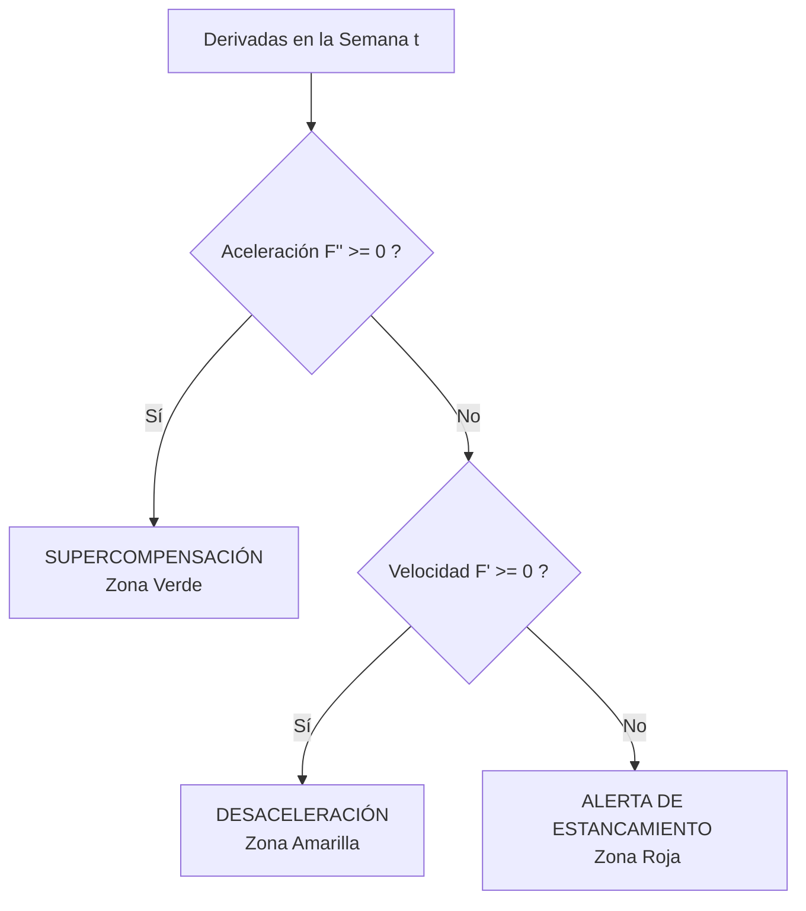

# Explicación del Algoritmo de Telemetría Neuromuscular e Inflexión de Fuerza

Este documento detalla el funcionamiento lógico, matemático y fisiológico del **Algoritmo de Telemetría Neuromuscular In-Device** desarrollado para PLNEXC, el cual opera tanto en modo de simulación teórica como con datos reales del usuario mediante regresión cúbica.

---

## 1. ¿Por qué se creó este algoritmo?

En los deportes de fuerza, la fatiga neuromuscular se acumula mucho antes de que el atleta experimente fatiga subjetiva o una lesión física. El progreso adaptativo no es lineal: responde a una curva de rendimientos decrecientes y acomodación fisiológica.

### Problemas que resuelve:
1. **Prevención del Estancamiento Temprano (Plateau)**: Alerta al atleta para que realice una semana de descarga (*deload*) antes de que su rendimiento empiece a decrecer de forma neta.
2. **Privacidad de Datos Biométricos (*Edge Computing*)**: Dado que el historial de fuerza y el peso corporal son datos biométricos sensibles, el procesamiento matemático complejo se realiza en el navegador del usuario de forma local, evitando enviar datos crudos a servidores de terceros.
3. **Optimización de Cargas**: Ayuda a entender si el cuerpo está asimilando eficientemente el estímulo de entrenamiento (Supercompensación) o si está en una fase de desaceleración adaptativa.

---

## 2. El Modelo Teórico (Simulador)

Para modelar la ganancia de fuerza a lo largo de un ciclo (simulado en bloques de 10 semanas), se utiliza la siguiente curva adaptativa continua:

### Ecuación de Rendimiento de Fuerza: $F(t)$
$$F(t) = -0.6t^3 + 6t^2 + 20t + 100$$
*   **Significado**: Fuerza absoluta teórica (o tonelaje total de volumen en kg) estimada para la semana $t$ (donde $t \in [0, 10]$).
*   La curva modela un crecimiento inicial acelerado que luego alcanza un punto de inflexión fisiológico y finalmente decae debido a la fatiga neuromuscular acumulada si no se realiza descanso.

### Velocidad de Adaptación (Primera Derivada): $F'(t)$
$$F'(t) = \frac{dF}{dt} = -1.8t^2 + 12t + 20$$
*   **Significado**: Tasa instantánea de ganancia de fuerza en un punto $t$ (en kg/semana).
*   Representa la pendiente de la recta tangente a la curva $F(t)$. Si $F'(t) > 0$, el atleta sigue mejorando de sesión en sesión. Si $F'(t) < 0$, la fuerza neta está disminuyendo.

### Aceleración Neuromuscular (Segunda Derivada): $F''(t)$
$$F''(t) = \frac{d^2F}{dt^2} = -3.6t + 12$$
*   **Significado**: Tasa de cambio de la velocidad adaptativa (en kg/semana²).
*   Mide la concavidad de la curva. Si $F''(t) < 0$, la curva es cóncava hacia abajo, indicando una pérdida de ritmo de mejora o "desaceleración", lo que fisiológicamente equivale a la acomodación al estímulo o la acumulación progresiva de fatiga del sistema nervioso central.

---

## 3. Modelo de Datos Reales: Regresión Cúbica por Mínimos Cuadrados

Cuando el usuario selecciona la pestaña **"Mi Telemetría"**, el widget calcula la curva que mejor se ajusta a su historial real de entrenamiento.

### 3.1. Recopilación de Puntos
Se extrae el historial del usuario, ordenándolo cronológicamente. Se calcula el tiempo transcurrido en semanas ($x_i$) desde la primera sesión registrada ($x_0 = 0$) y el volumen total o por ejercicio ($y_i$ en kg).
Para ajustar un polinomio cúbico, se requiere un mínimo de **4 puntos con volumen válido (mayor a 0)**.

### 3.2. Formulación Matemática de la Regresión Cúbica
Buscamos estimar los coeficientes $a, b, c, d$ para la función:
$$F(t) = a t^3 + b t^2 + c t + d$$

Para lograr el mejor ajuste, minimizamos la suma de los errores al cuadrado (Mínimos Cuadrados):
$$E(a, b, c, d) = \sum_{i=1}^n \left( y_i - (a x_i^3 + b x_i^2 + c x_i + d) \right)^2$$

Tomando las derivadas parciales con respecto a cada coeficiente e igualándolas a cero, obtenemos el sistema de ecuaciones normales:

$$\frac{\partial E}{\partial d} = 0 \implies d \cdot n + c \sum x_i + b \sum x_i^2 + a \sum x_i^3 = \sum y_i$$
$$\frac{\partial E}{\partial c} = 0 \implies d \sum x_i + c \sum x_i^2 + b \sum x_i^3 + a \sum x_i^4 = \sum x_i y_i$$
$$\frac{\partial E}{\partial b} = 0 \implies d \sum x_i^2 + c \sum x_i^3 + b \sum x_i^4 + a \sum x_i^5 = \sum x_i^2 y_i$$
$$\frac{\partial E}{\partial a} = 0 \implies d \sum x_i^3 + c \sum x_i^4 + b \sum x_i^5 + a \sum x_i^6 = \sum x_i^3 y_i$$

### 3.3. Resolución del Sistema Matricial
El sistema de ecuaciones lineales $A \beta = B$ se define como:

$$
\begin{pmatrix}
n & \sum x_i & \sum x_i^2 & \sum x_i^3 \\
\sum x_i & \sum x_i^2 & \sum x_i^3 & \sum x_i^4 \\
\sum x_i^2 & \sum x_i^3 & \sum x_i^4 & \sum x_i^5 \\
\sum x_i^3 & \sum x_i^4 & \sum x_i^5 & \sum x_i^6
\end{pmatrix}
\begin{pmatrix}
d \\
c \\
b \\
a
\end{pmatrix}
=
\begin{pmatrix}
\sum y_i \\
\sum x_i y_i \\
\sum x_i^2 y_i \\
\sum x_i^3 y_i
\end{pmatrix}
$$

Este sistema de $4 \times 4$ es resuelto dinámicamente en el cliente utilizando **Eliminación Gaussiana con Pivoteo Parcial** y **Sustitución Hacia Atrás** (back-substitution). Si la matriz es singular (determinante cercano a 0), el algoritmo retorna `null` para evitar errores de división por cero y notifica una falta de consistencia en los datos.

### 3.4. Derivadas en Datos Reales
Una vez obtenidos los coeficientes $[a, b, c, d]$, las derivadas instantáneas en la semana seleccionada $t_0$ se calculan como:
*   **Volumen estimado**: $F(t_0) = a t_0^3 + b t_0^2 + c t_0 + d$
*   **Velocidad de cambio (Pendiente)**: $F'(t_0) = 3 a t_0^2 + 2 b t_0 + c$
*   **Aceleración (Concavidad)**: $F''(t_0) = 6 a t_0 + 2 b$

---

## 4. Umbrales de Estado Lógico para Alertas

El motor de telemetría evalúa en tiempo real las derivadas en la semana activa $t_0$ para clasificar el estado del atleta en una de las tres zonas:

### 1. Zona de Supercompensación (Verde)
*   **Condición**: $F''(t) \ge 0$ (Aceleración neuromuscular positiva).
*   **Fisiología**: El cuerpo asimila óptimamente el estímulo y la tasa de progreso está acelerándose de forma exponencial o lineal ascendente.
*   **Rango en la simulación**: Semanas $t \in [0, 3.33]$.

### 2. Zona de Desaceleración (Amarillo)
*   **Condición**: $F''(t) < 0$ y $F'(t) \ge 0$ (Aceleración negativa, velocidad positiva).
*   **Fisiología**: El punto de inflexión ha sido superado. El atleta continúa mejorando (su volumen acumulado sigue subiendo), pero la velocidad de esa ganancia es cada vez menor debido al fenómeno de la acomodación del organismo y fatiga incipiente del Sistema Nervioso Central (SNC).

### 3. Zona de Alerta de Estancamiento (Rojo)
*   **Condición**: $F''(t) < 0$ y $F'(t) < 0$ (Velocidad y aceleración negativas).
*   **Fisiología**: Supercompensación saturada. El atleta ha llegado a la fase de agotamiento del Síndrome de Adaptación General (GAS). Seguir entrenando al mismo volumen causará estancamiento crónico o sobreentrenamiento.
*   **Acción recomendada**: Programar inmediatamente una semana de descarga (*deload*).

---

## 5. Implementación y Ciberseguridad

Para proteger el historial de fuerza y las simulaciones del usuario de forma íntegra contra ataques e inyecciones de datos, el flujo de desarrollo implementa:
*   **Hardening a nivel de Base de Datos**: Reglas de seguridad (`firestore.rules`) que garantizan que el historial de fuerza `/users/{userId}/strengthHistory/{recordId}` solo sea legible y modificable por el usuario propietario autenticado.
*   **Sanitización e integridad lógica en cliente**: Uso de tipos estáticos en TypeScript para validar datos del historial (por ejemplo, omitiendo sesiones de volumen nulo o negativo) antes de alimentar el motor de regresión cúbica.
*   **Computación Edge**: Toda la resolución matricial y derivadas ocurren en el hilo principal del navegador. Ningún dato sensible del entrenamiento es enviado a APIs externas para el cómputo de la regresión.
